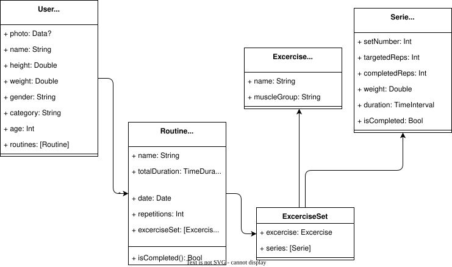

# Xpartan

**Xpartan** is an iOS workout tracking app built with SwiftUI and SwiftData. It lets multiple users log their training sessions, track exercises in real time, and review performance stats — all stored locally on device.

---

## Features

- **Multi-user profiles** — Create and manage multiple athletes with personal stats (height, weight, age, category)
- **Workout routines ("Xpartanos")** — Start a structured routine with a full set of pre-loaded exercises
- **Live exercise cards** — Per-exercise timers, rep counters, and weight tracking during a session
- **Session timer** — Global stopwatch that records total workout duration
- **Routine history & stats** — Completed routines are saved with duration and rep data for later review
- **Offline-first** — Fully local, powered by SwiftData with no backend required

---

## Data Model

---

## Tech Stack

| Layer | Technology |
|-------|-----------|
| UI | SwiftUI |
| Persistence | SwiftData |
| Platform | iOS 17+ |
| Language | Swift |

---

## Getting Started

1. Clone the repo
2. Open `xpartan.xcodeproj` in Xcode 15+
3. Select a simulator or device running iOS 17+
4. Build and run (`⌘R`)

No external dependencies or API keys required.

---

## License

See [LICENSE](LICENSE).
